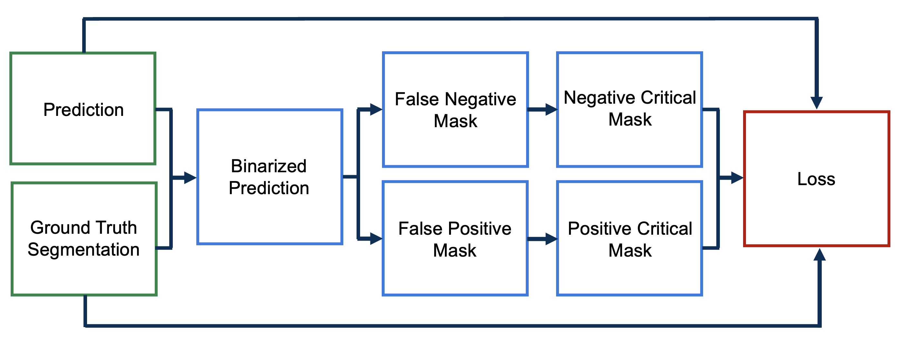

# Efficient Connectivity-Preserving Instance Segmentation with Supervoxel-Based Loss Function

[](LICENSE)

[](https://github.com/semantic-release/semantic-release)


[paper](https://arxiv.org/abs/2501.01022) | [poster](https://github.com/AllenNeuralDynamics/supervoxel-loss/blob/main/imgs/poster.pdf)

This repository implements a connectivity-preserving loss function that improves segmentation of curvilinear structures by penalizing both structure-level and voxel-level mistakes. The structure-level loss is calculated by computing supervoxels (i.e. connected components) in the false positive and false negative masks, then assigning higher penalties to *critical* supervoxels that introduce connectivity errors.

## Method

The loss computation consists of three main steps:

<blockquote>
  <p>1. <strong>Binarized Prediction</strong>: Prediction generated by neural network is thresholded into a binary mask to separate foreground from background.</p>
  <p>2. <strong>False Postive/Negative Masks</strong>: Computed by comparing binarized prediction to the ground truth.</p>
  <p>3. <strong>Critical Supervoxels</strong>: Detect connected components in false positive/negative mask that cause connectivity errors.</p>
</blockquote>

Finally, the loss is computed by comparing the prediction with the ground truth segmentation, applying higher penalties to voxels within critical supervoxels that affect connectivity.
<br>
<br>

<p>
  
  <br>
  <b> Figure: </b>Visualization of supervoxel-based loss computation.
</p>

## Usage

Here is a simple example of using this loss function to train a model.

```python
import torch.nn as nn
import torch.optim as optim

from supervoxel_loss.loss import SuperVoxelLoss2D

    
# Initialization
model = UNet()
optimizer = optim.AdamW(model.parameters(), lr=1e-4)

loss_switch_epoch = 10
voxel_loss = nn.BCEWithLogitsLoss()
supervoxel_loss = SuperVoxelLoss2D(alpha=0.5, beta=0.5)

# Main
for epoch in range(n_epochs):
    # Set loss function based on the current epoch
    if epoch < loss_switch_epoch:
        loss_function = voxel_loss
   else:
        loss_function = supervoxel_loss

    # Training loop
    for inputs, targets in dataloader:
        # Forward pass
        preds = model(inputs)

        # Compute loss
        loss = loss_function(preds, targets)

        # Backward pass
        optimizer.zero_grad()
        loss.backward()
        optimizer.step()
```

## Installation
To use the software, in the root directory, run
```bash
pip install -e .
```

## Contact Information
For any inquiries, feedback, or contributions, please do not hesitate to contact us. You can reach us via email at anna.grim@alleninstitute.org or connect on [LinkedIn](https://www.linkedin.com/in/anna-m-grim/).

## License
supervoxel-loss is licensed under the MIT License.
